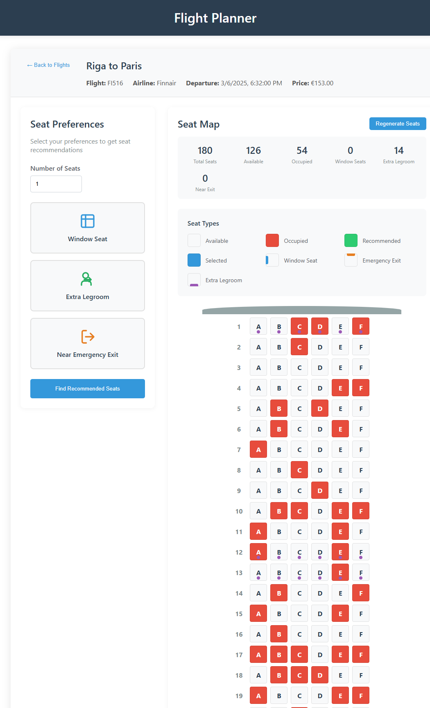

# Flight Planner Frontend

This project is the user interface for a flight planner application, allowing users to browse, search, filter flights, and manage seat arrangements.

## Prerequisites

Before getting started, make sure you have the following installed on your computer:

- Node.js (recommended version 14.x or newer)
- npm (usually comes with Node.js)
- Git

## Downloading the Project

To download the project to your computer, follow these steps:

1. Open your terminal (or command prompt on Windows).
2. Navigate to the directory where you want to download the project.
3. Clone the repository:
   git clone https://github.com/Artjomeller/Flight-Planner-frontend.git

## Navigate into the project directory:
    `cd Flight-Planner-frontend`

## Installing Dependencies
    `npm install`

## Running the Application
    `npm start`

This will run the application in development mode. Open http://localhost:3000 in a web browser to view the app. The page will reload automatically when you make code changes.

Backend Connection
This frontend application requires the Flight Planner backend API to be running and accessible. By default, the frontend expects the backend service to be running at http://localhost:8080.

To start the backend application, refer to the Flight Planner Backend repository.

### Project Structure

The main components of the project include:

1. src/components/ - React components of the application
2. src/styles/ - CSS style sheets
3. src/services/ - API connections and services
4. public/ - Static content and index.html

### Technologies
React - User interface framework
CSS - Styles

### © 2025 Artjom Eller